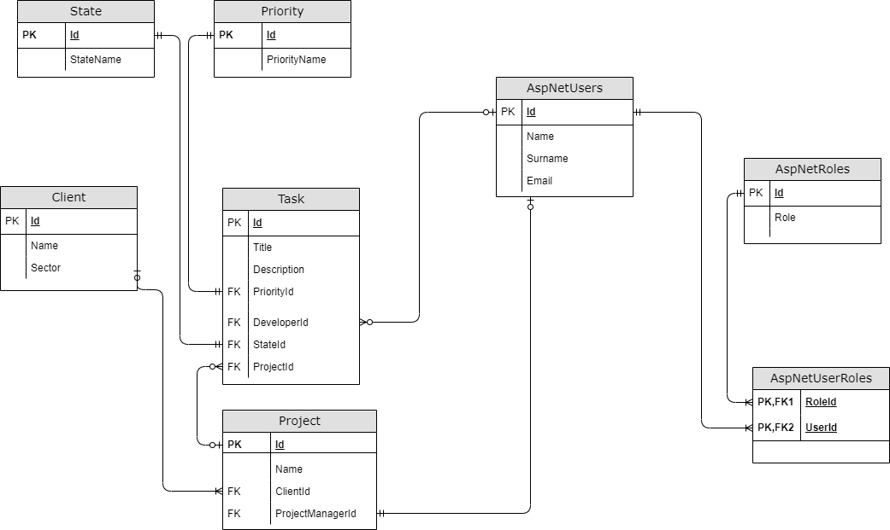

1. Install EF Core tools: https://docs.microsoft.com/en-us/ef/core/cli/dotnet
2. Create database, and copy connection string to the appsettings.json ["ConnectionStrings": { "Default": "YourConnectionString" }] file which is in TaskManager folder
3. Run migration update: dotnet ef database update.
4. In appsettings.json file update your email data:
		"Mailer": {
    "Port": "YourPort",
    "Host": "YourHost",
    "Password": "PasswordForEmail"
  }
  
  
  Environment_Postman: Local_API and Server_API
  and
  Collection_Postman: TaskManagement
  can be found in TaskManager.Test
  for testing purposes

